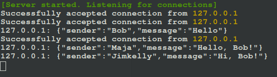
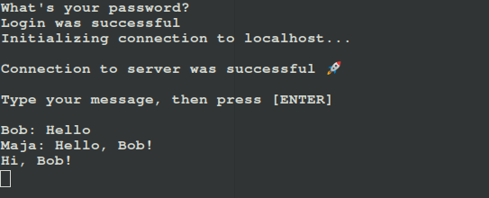

## A Pair of Client-Server Apps Written in Nim

Put simply, this is a pair of client-server apps facilitating many-to-many communication, similar to IRC.

The source code contained herein is by no means a 
complete implementation of what is trying to be achieved. 
However, it has been written with a vision of progressing
towards that bulwark that is an efficient, reliable,
production ready project.

> A huge shoutout to [Dominik Picheta](https://github.com/dom96), author of the fantastic book on [Nim](https://nim-lang.org/, "Visit the language's official Website"), [Nim In  Action](https://www.manning.com/books/nim-in-action, "View Book on Manning"). Heavily drawing inspiration from his source code in *Chapter 3: Writing a Chat Application* of his book, this project attempts to pick up from where he left, by adding a couple of features:
>
> - A persistent database ([sqlite](https://www.sqlite.org/index.html, "Read more about the database")). This will be used to store client data after they create an account. Such data comprises their username, email address, and password.
> - Security. In order to make a successful connection to the server and start sending messages to other connected clients, a client has to enter the correct password they used when creating their account.
> - As a bonus, you get to see how to leverage the power of [std/terminal](https://nim-lang.org/docs/terminal.html, "View package's docs"), to style the output on the standard output or error streams of your implemention, which in most cases, is your Terminal, or Command Prompt.
>
> This source code has been provided as 'best effort'. Certainly, one can implement the same added features in better ways, and even create new pretty cool ones. Should you feel particularly inspired, plese feel free to do so!

### Requirements for Source Code Compilation

If you wish to compile the source code on your own, it's relatively easy to do so. Make sure you've installed the [Nim Programming Language](https://nim-lang.org/, "Visit the language's official Website") somewhere on your system.
To check if you have the said language installed, fire up a terminal, or command prompt and issue the following command:

    $ nim -v

or this:

    $ nim --version

If the language has been installed, you should get output that closely resembles this:

    Nim Compiler Version 1.6.2 [Linux: amd64]
    Compiled at 2021-12-17
    Copyright (c) 2006-2021 by Andreas Rumpf

    git hash: 9084d9bc02bcd983b81a4c76a05f27b9ce2707dd
    active boot switches: -d:release

If, however, you'd like to download and install [Nim](https://nim-lang.org/, "Visit the language's official Website"), you can easily follow the official [download instructions](https://nim-lang.org/install.html), and you'll be all set!

> In addition, you need to make sure you have [Nimble](https://github.com/nim-lang/nimble, "View tool on GitHub"), the default package manager for [Nim](https://nim-lang.org/, "Visit the language's official Website") installed. If you are using Nim version 0.15.0 odd, or greater, you most probably have it installed, since Nim installation packages have been including it since then.

## Compilation

To compile the server binary, cd into the root of the project and issue the following command:

    $ nimble c src/server.nim

or this:

    $ nimble compile src/server.nim

> Using **nimble compile** instead of **Nim compile** to compile your .nim source code files makes sure the dependencies specified in the project's .nimble file have first been installed, before proceeding with the compilation.

If everyting goes on well, you should get output along the following lines:

    Verifying dependencies for client_server_app@0.1.0
    Info: Dependency on bcrypt@>= 0.2.1 already satisfied
    Verifying dependencies for bcrypt@0.2.1
    Compiling src/server (from package client_server_app) using c backend
    Success: Execution finished

The output may, of course, vary. I already had the required dependency installed, and as such, got the above output. If, however, the said dependency insn't installed, you should see output informing you that Nimble is attempting to fetch it.

Similary, to compile the client binary, from the project's root, issue the following command:

    $ nimble c src/client.nim

or this:

    $ nimble compile src/client.nim

This beautiful line should, again, let you know that you are on the right track:

    Success: Execution finished

The compiled binaries for both the client and server are located in the **bin** directory, and you should now find them there:

## Usage

Using the compiled binaries is easy.

First, you need to start the server, in order to actively listen and accept connections from clients. From the root of your project, issue the following command:

    $ ./bin/server

If all goes well, you should see the following message on your standard output stream:

    [Server started. Listening for connections]

Open a new terminal, and navigate to where your project clives. From the root of it, issue the folliowing command to launch a client:

    $ ./bin/client localhost

You should get the following output:

    What would you like to do?

    1) Login
    2) Create Account
    3) Quit

    Choice:

Make your desired selection and duly follow the prompts onscreen. After either successfully creating an account, or logging in, you should see the following output:

    Login was successful
    Initializing connection to localhost...

    Connection to server was successful 🚀

    Type your message, then press [ENTER]

On the server, this will be displayed:

    [Server started. Listening for connections]
    Successfully accepted connection from 127.0.0.1

Launch multiple other clients, logging in with different accounts to simulate a many-to-many chat experience. Below is an example of output I got:

From the server:

And from one client:

You can find the database file, **clients.db** in the **databases/sqlite/** directory for your inspection.

